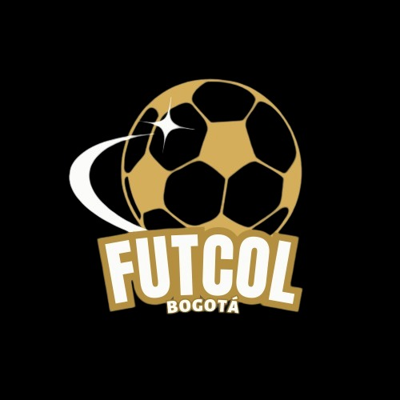

  

# 🏆 FUTCOL

**Sistema de información para la organización de torneos de microfútbol en Bogotá.**

---

## 🎯 Slogan

> _"¡Donde los torneos cobran vida y la pasión por el fútbol se vive al máximo!"_

---

## 🎯 Objetivo General

Desarrollar un sistema para la organización de torneos de microfútbol en Bogotá.

---

## ✅ Objetivos Específicos

- Optimizar la inscripción y registro de equipos y jugadores.  
- Registrar y difundir resultados y estadísticas en tiempo real.  
- Impulsar la adopción de herramientas tecnológicas en la organización de torneos.

---

## 🧠 Planteamiento del Problema

Una aplicación destinada a organizar torneos de microfútbol en Bogotá enfrentaría una serie de desafíos en diversas áreas. Desde un punto de vista tecnológico, la falta de una plataforma centralizada para la gestión de torneos, junto con las dificultades de comunicación entre equipos y organizadores, así como los problemas logísticos para la programación de partidos y la actualización de resultados, representarían obstáculos significativos. Además, en un contexto donde aún no se está tan familiarizado con la tecnología en Colombia, la adopción de una nueva aplicación podría enfrentar resistencia o requerir un proceso de adaptación por parte de los usuarios. 
Socialmente, la dificultad para encontrar comunidades locales de microfútbol, las limitaciones en la integración de personas de diferentes estratos socioeconómicos y las barreras de acceso a información sobre torneos locales complicarían la organización de eventos deportivos. Además, la ausencia de una plataforma que promueva la cultura del deporte en la comunidad, la falta de visibilidad para equipos y jugadores aficionados, y la necesidad de preservar y promover tradiciones deportivas locales añadirían complejidad al proyecto. 
En términos de salud, la promoción de un estilo de vida activo y saludable a través de la participación en el deporte, la facilitación de la creación de hábitos saludables de ejercicio y competición, y el fomento de la camaradería y el compañerismo entre los participantes serían objetivos importantes, pero con sus respectivas complicaciones. Por último, los desafíos económicos, como la dificultad para financiar y gestionar torneos de forma eficiente, la falta de oportunidades para patrocinadores locales de llegar a un público objetivo, y los problemas de acceso a recursos económicos para la organización de eventos deportivos, también representarían obstáculos importantes para la aplicación. 
A través de la innovación y la excelencia en el servicio, el aplicativo se posicionará como pionera en la organización de torneos de microfútbol en Bogotá, contribuyendo al desarrollo del deporte y al bienestar de la población. 

---

## 🚀 Justificación

Bogotá es una ciudad donde el microfútbol es una de las actividades deportivas más populares, pero aún carece de una plataforma centralizada que facilite la organización y participación en torneos de manera eficiente. FutCol nace para llenar este vacío, ofreciendo una solución innovadora que permite a cualquier persona crear, gestionar y participar en torneos de microfútbol de forma accesible e inclusiva, sin importar edad, género o nivel de experiencia.
El sistema no solo optimiza la logística del torneo (calendarios, resultados, inscripciones), sino que también incorpora herramientas de análisis de datos para mejorar el rendimiento de equipos y jugadores, dándoles visibilidad y promoviendo el desarrollo deportivo. Además, promueve la formación de comunidades deportivas locales, fomenta la práctica de hábitos saludables y activa la integración entre personas de diferentes contextos socioeconómicos.
Desde el punto de vista económico, FutCol crea nuevas oportunidades para patrocinadores, árbitros y organizadores locales, dinamizando el ecosistema deportivo amateur en Bogotá. Con esta plataforma, se busca transformar el microfútbol en una experiencia más profesional y emocionante, alineada con las tendencias digitales y accesible para todos.
En resumen, FutCol no solo organiza torneos, sino que conecta a la comunidad, promueve el deporte y contribuye al bienestar de los ciudadanos, posicionándose como la plataforma líder en la organización de torneos de microfútbol en Bogotá.

---

## 🌍 Alcance

Llegar a ser la plataforma líder en la organización y creación de torneos de microfútbol en Bogotá conectando a jugadores de todas las edades y niveles fomentando la pasión por el deporte a través de una experiencia innovadora accesible y competitiva, ofreciendo una interfaz intuitiva y sencilla para que cualquier persona pueda crear, gestionar y participar en torneos de microfútbol 
Ampliando la variedad de opciones como brindar una  gama completa de elecciones  para personalizar los torneos  empezando con el número de equipos y jugadores hasta las reglas y el sistema de competición proporcionando unas herramientas eficientes para la organización de los torneos como la creación de calendarios, la gestión de resultados y la comunicación con los participantes cuando una  comunidad online donde los jugadores puedan interactuar entre sí, compartir su pasión por el microfútbol y encontrar nuevos compañeros de equipo 
Ofreciendo una experiencia de juego competitiva y emocionante a través de torneos bien organizados, con árbitros profesionales y premios atractivos permitiendo que cualquier persona pueda participar en los torneos, independientemente de su edad, sexo o nivel de experiencia. 
Promocionando el deporte y fomentando la práctica del microfútbol como una actividad física sana y divertida para todas las edades. 
El aplicativo se convertirá en un espacio donde la pasión por el microfútbol se une a la tecnología para crear una experiencia única e inolvidable para todos los participantes. 

---

